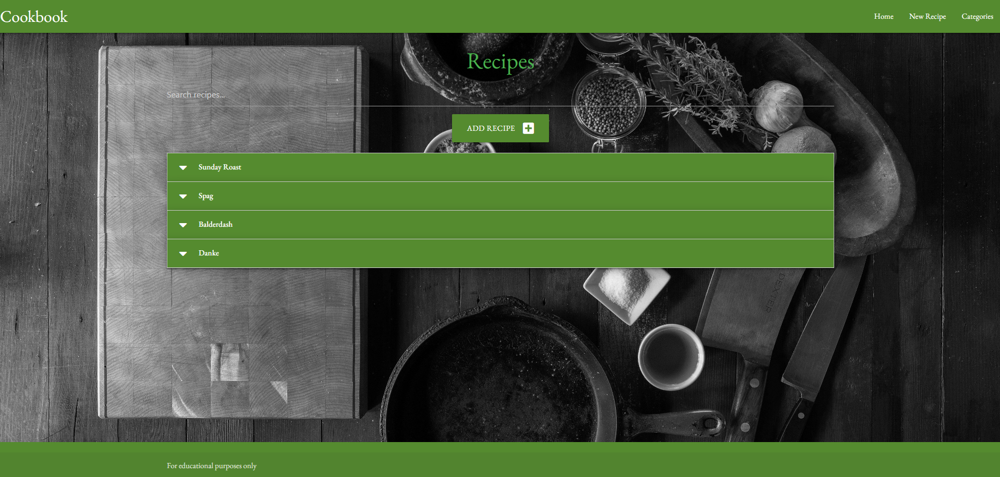
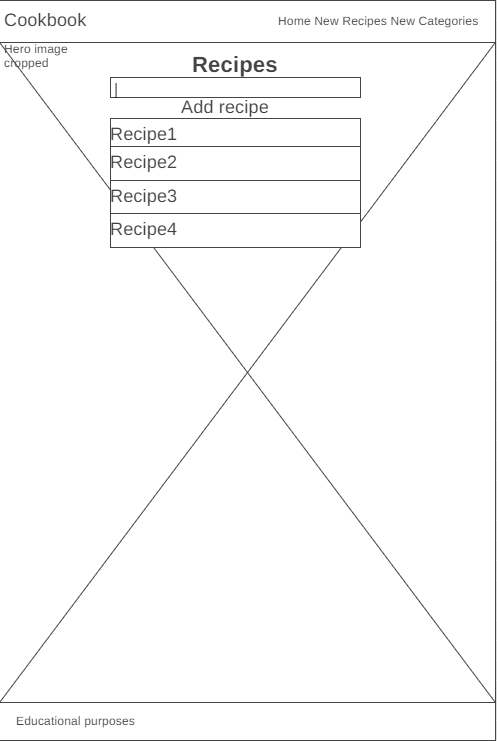
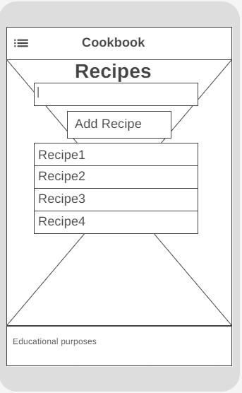
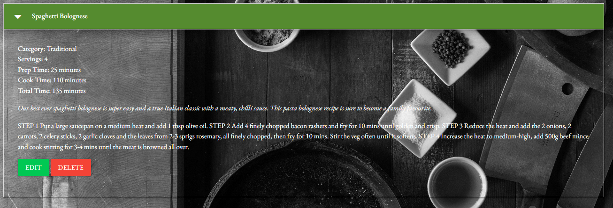
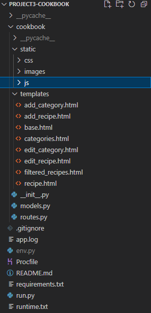
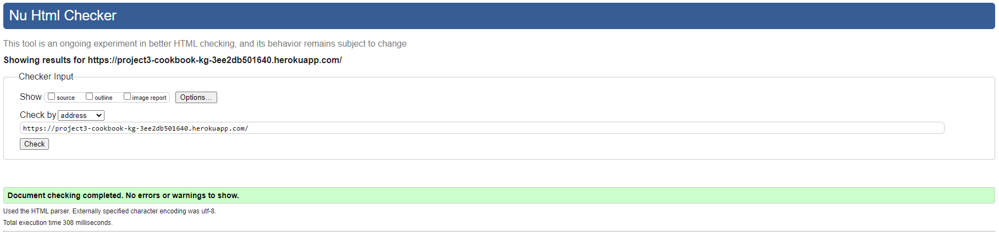
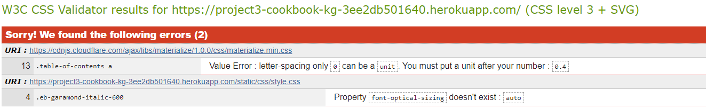
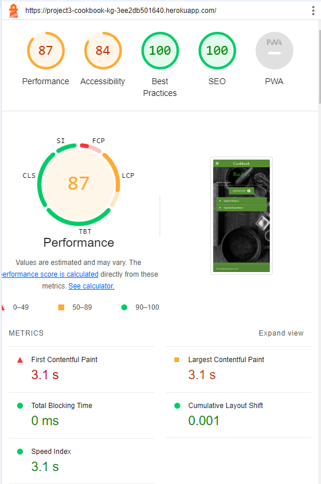

# Project Documentation: Cookbook App

## Project Rationale

### Project Introduction

The **Cookbook App** is designed to provide users with a platform to explore, discover, and save recipes from various cuisines and dietary preferences. The idea originated from the desire to create a user-friendly application that offers a wide range of recipes for users to explore and enjoy.

To view the deployed website click [here](https://project3-cookbook-kg-3ee2db501640.herokuapp.com/).

### User Story

"As a cooking enthusiast, I want to be able to easily find and access a variety of recipes based on my dietary preferences and available ingredients. I also want the option to save my favorite recipes for future reference, creating a personalized collection of recipes that I can refer back to whenever I need cooking inspiration."

### Project Goals and Objectives

The primary goal of the project is to create a comprehensive and user-friendly recipe platform that caters to the diverse needs and preferences of users. Objectives include providing a database of recipes, implementing intuitive search and navigation features, and enabling users to save and organize their favorite recipes.

### Target Audience

The target audience includes cooking enthusiasts, home cooks, and individuals with dietary restrictions or specific culinary preferences. The app aims to appeal to a wide range of users, from beginners looking for simple recipes to experienced chefs wanting to save thir own recipes.

### Scope and Features

The project includes features such as recipe search and filtering and the ability to save favorite recipes. The scope is focused on creating a functional and user-friendly recipe platform with the potential for future enhancements.

## Development Life Cycle

### Planning

#### Project Kickoff

- **Objective:** Create a recipe platform that meets the needs of cooking enthusiasts and home cooks.
- **Activities:**
  - Define the core features and functionality of the app.
  - Identify the target audience and their preferences.

#### Requirements Gathering

- **Objective:** Identify detailed requirements to inform the design and development process.
- **Activities:**
  - Define user stories and personas to understand user needs and expectations.
  - Identify technical requirements, including platform compatibility and data storage options.

1. **Recipe Search and Filtering:**
   - Users can search for recipes based on keywords.
   - Filtering options allow users to narrow down search results based on various criteria.

2. **Recipe Details and Nutritional Information:**
   - Detailed recipe pages display ingredients, instructions, cooking tips.
   - Nutritional information includes calorie count, macronutrient breakdown, and dietary labels is a future project.

#### Content Requirements

Content requirements specify the specific elements, visuals, and information needed for the app.

1. **Recipe Data:**
   - Utilize a comprehensive database of recipes from various cuisines and sources.
   - Ensure accurate and up-to-date recipe information, including ingredients and instructions.

2. **Nutritional Information (Future Expansion):**
   - Integrate a nutritional database or API to retrieve accurate nutritional information for each recipe.
   - Display nutritional facts in a user-friendly format on recipe pages.

#### Additional Notes

- All app features and functionalities should prioritize user experience and usability.
- Maintain a balance between complexity and simplicity to cater to users with varying levels of cooking expertise.
- Regular user testing and feedback should inform iterative improvements throughout the development process.

### Design

#### Agile Project Development

The development of the Cookbook app follows an Agile project development lifecycle. Agile principles have been applied to promote flexibility and iterative improvements throughout the development process.

##### Iterative Development

The project is divided into iterative cycles or sprints, each focusing on specific features and enhancements. This approach allows for continuous refinement and adaptation based on feedback and evolving requirements.

##### User-Centric Design

The design process prioritizes the user experience, ensuring that the app is intuitive, engaging, and accessible. Regular feedback loops, including user testing and feedback, contribute to user-centric design decisions.

#### User Interface (UI) Design

The user interface design aims to provide a visually appealing and seamless experience for Cookbook users.

##### Color Scheme

The color scheme is carefully chosen to enhance readability, accessibility, and overall aesthetics. A combination of warm and inviting colors promotes a welcoming atmosphere within the app.

##### Typography

Clear and legible typography EB Garamond is selected to ensure easy readability and navigation throughout the app. Consistent font styles contribute to a cohesive and professional UI.

##### Layout and Responsiveness

The app layout is designed to be responsive, adapting to various screen sizes and devices. Materialize grid-based layouts enhance the organization of content, providing a structured and visually appealing interface.

#### App Elements and Features

The design of app elements and features contributes to an intuitive and enjoyable user experience.

##### Recipe Cards

Recipe cards display essential information such as recipe title and brief description. Users can easily navigate through recipes and access detailed recipe pages.

##### Search Bar

A search bar allows users to quickly find recipes based on keywords.

##### Recipe Details

Detailed recipe pages provide comprehensive information including ingredients, instructions, cooking tips.

##### Defensive Design

Modal overlays prevent data loss when deleting by accident.

#### External APIs Integration (Future Development)

The app incorporates external APIs to enrich the user experience and provide additional content.

### Implementation

#### Technologies Used

The implementation of the Cookbook app involves the use of various technologies to create a fully functional and interactive web application. Key technologies include:

- **HTML:** The structure of the app is defined using HTML, providing a foundation for content presentation.

- **Materialise:** This project uses googles Materialize framework as it is easy to work with and the simple layout appeals to users.

- **Flask:** This project uses the Flask app design as it is lightweight and developer friendly utilizing python and jinja templating.

- **CSS:** Cascading Style Sheets are used to style and enhance the visual elements of the app, ensuring a polished and cohesive appearance.

- **JavaScript:** Interactive elements and dynamic content are implemented using JavaScript, creating a seamless user experience.

#### Folder Structure

The project follows a well-organized folder structure for easy navigation and maintenance. Here's an overview:

#### HTML Structure

The HTML files define the structure and content of the app, including pages such as home, recipe details, search results, and category pages. Key components include:

- **Title and Meta Tags:** Ensuring proper rendering and search engine optimization (SEO).

- **External Stylesheets and Scripts:** Links to external resources for styling and functionality.

- **App Elements:** Structure for navigation menus, recipe cards, search bar, and content sections.

#### CSS Styling

The CSS files are responsible for styling the HTML elements, ensuring a visually appealing and consistent design. Materialize framework provides the majority of the CSS although some custom parts are added like the background image.

#### JavaScript Functionality

The script files are responsible for initialising interactive html functionality namely collapsiblies and button clicks.

### Testing

Throughout the development process of the Cookbook project, extensive testing was conducted to ensure the reliability and functionality of the application. The following tests were performed after each iteration of code changes.

| Test Category             | Test Description                                                                        |
|---------------------------|------------------------------------------------------------------------------------------|
| Model Initialization      | 1. Create instances of Category and Recipe models. 2. Verify correct initialization of attributes. |
| CRUD Operations           | 1. Create, read, update, and delete operations on Category and Recipe models. 2. Ensure data integrity and consistency. |
| Form Submission           | 1. Submit forms for adding and editing recipes and categories. 2. Validate form submissions and database updates. |
| Route Functionality       | 1. Test all routes for proper rendering of templates and handling of requests. 2. Verify correct redirection and error handling. |
| Data Display              | 1. Ensure recipes and categories are displayed correctly on the home and category pages. 2. Check for proper formatting and styling. |
| Input Validation          | 1. Submit forms with invalid data and ensure appropriate error messages are displayed. 2. Validate input length, format, and required fields. |
| Error Handling            | 1. Intentionally trigger errors (e.g., database connection error) and verify error handling. 2. Ensure graceful error messages are displayed to users. |
| Cross-Browser Testing     | 1. Test the application on different web browsers (Chrome, Firefox, Safari, Edge) for compatibility. 2. Verify consistent functionality and layout across browsers. |
| Responsiveness            | 1. Test the application on various screen sizes (desktop, tablet, mobile) for responsiveness. 2. Ensure proper layout adjustment and readability. |
| Accessibility             | 1. Use screen readers to navigate the application and ensure accessibility. 2. Test keyboard-only navigation and ensure all features are accessible. |
| Integration Testing       | 1. Test interactions between different components of the application (e.g., front-end and back-end). 2. Verify seamless data flow and communication between modules. |

#### HTML Validator
The website passes W3 validator with no issues.

#### CSS Validator
The website passes W3 validator with inconsequential errors. Font-optical is compatible with all modern browsers and letter-spacing is part of the Materialize package which is verified by Google.

These tests ensure that the Cookbook application functions as intended, providing users with a reliable and user-friendly experience while interacting with recipes and categories.
More tests were undertaken and are contained in a Word document in the static folder testing.

#### Lighthouse Testing
The website passed the Lighthouse testing.

### Deployment

The app is deployed to Heroku to make it accessible to users worldwide. Continuous deployment practices ensure that updates and enhancements are deployed seamlessly to the production environment.